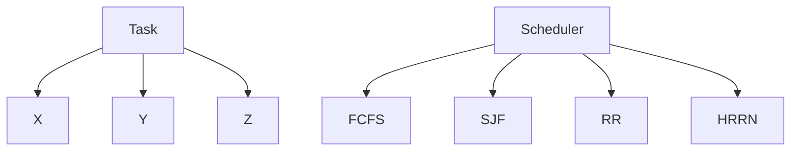

# OS 2nd Project - Scheduler Simulation
**Mahdi Nasehiyan**, Spring of 2023
This documentation is a brief overview of my implementation for the 2nd project of the Operating Systems course, Which is a simulation for CPU scheduler. The project simulates the following 4 scheduling algorithms:

 - First-comes-first-served (FCFS)
 - Shortest-job-first (SJF) (Non-preemptive)
 - Round-Robin
 - Highest-response-ratio-next (HRRN)

# Files

The project consist of 3 python files:

 - **Task.py**: Includes the base class for Task, and the 3 sub-classes for each task type X, Y, and Z
 - **Scheduler.py**: Includes the base class for Scheduler and one sub-class per each scheduling algorithm
 - **main.py**: Driver script
 Besides the codebase, there is a sample input for the driver script (**in.txt**) and its corresponding output (**out.txt**).

# Classes

Below is the class hierarchy of the project:

## Task

The Task class acts mostly as a data structure for keeping data about each task, and additionally it provides a few functionalities for better integration with the Scheduler instances. Task is not an abstract method and can be directly instantiated.
Here are some of the key attributes that each Task instance hold:

 - A name
 - Duration of the task (time units)
 - Resource needs (how many of each resource type)
 - Resources currently holding
 - Task priority
 - Task state (Ready/Waiting/Running/Finished)
 - Remaining time of execution
 - Wait time (Used by HRRN algorithm)

The most important method implemented in this class is `tick()`, which is called by the scheduler after each time unit is passed. The Task instance will decrease the remaining time of execution by 1 if `state=='Running'`, otherwise it will increase the wait time.

## Scheduler
An scheduler without an scheduling algorithm is not much of a practical entity. Hence the Scheduler class is an abstract base class providing all the needed infrastructure and functionalities needed for scheduling algorithms to work. The Scheduler class has only one abstract method: `schedule()`, Which is where the scheduling algorithm will be implemented.
Below is everything the Scheduler class provides, explained very briefly:

 - Naively simulate the existence of a single CPU core.
 - Naively simulate the time unit of that CPU core, and keep track of the time.
 - Implement a **ready** queue, a **waiting** queue, and a **running** slot.
 - Provide a mechanism for moving tasks between queues or dispatching them to the CPU.
 - Keep track of how much of each is resource type is available.
 - Assign resources to tasks, release resources from tasks.

The ready and waiting queues are implemented as pure python lists:

    self.ready: List[Task] = []
 The ready queue is not implemented as a priority queue; purely by personal preference. Each scheduling algorithm will have full control over the queue.

> The Scheduler class provides a queue, how and based on what priority
> tasks are chosen from this queue is completely in the hands of
> scheduling algorithms.

Once an algorithm is implemented in a subclass of Scheduler,  instantiated, and provided with a bunch of Task instances, everything can be started with just one call to the `run()` method. This method is the main event loop firing every procedure with our desired sequence:

 1. Calling `tick()` on every Task instance, informing them that one time unit has passed (`one time unit = one cycle of the main event loop`).
 2. Terminated the running task, if finished, and releasing resources.
 3. Calling a method for controlling the waiting queue (And handling the movements between the two queues if needed).
 4. Calling the scheduling algorithm.

The `run()` method will go on as long as there are **unfinished** tasks,.
### A Limitation
Before we go on and investigate more into the project, lets talk about an important concept in this project. The project description explicitly mentions:

 - We have a single CPU core.
 - We have a finite amount of each resource types.
 - A waiting queue plus additional mechanisms for moving tasks between the two queues must be implemented.

The waiting queue's role comes into play when a task is about to be dispatched, but the resources needed by it are not available. The task is placed inside the waiting queue until the resources are available and it will be moved back into the ready queue.

> This scenario can only happen when the resources needed by a task are being
> held by another task! Since we only have one CPU core, all resources will be free upon dispatching a task.

Here is an example of running the SJF algorithm:

    R1:2    R2:2    R3:2
    Ready Queue: [T3,T2,T1]
    Waiting Queue: []
    Running: None
    --------------------------------------------------
    R1:2    R2:1    R3:1
    Ready Queue: [T3,T1]
    Waiting Queue: []
    Running: T2
    --------------------------------------------------
    R1:1    R2:1    R3:2
    Ready Queue: [T3]
    Waiting Queue: []
    Running: T1
    --------------------------------------------------
    R1:1    R2:1    R3:2
    Ready Queue: [T3]
    Waiting Queue: []
    Running: T1
    --------------------------------------------------
    R1:1    R2:1    R3:2
    Ready Queue: [T3]
    Waiting Queue: []
    Running: T1
    --------------------------------------------------
    R1:2    R2:1    R3:1
    Ready Queue: []
    Waiting Queue: []
    Running: T3
    --------------------------------------------------
    R1:2    R2:1    R3:1
    Ready Queue: []
    Waiting Queue: []
    Running: T3
    --------------------------------------------------
    R1:2    R2:1    R3:1
    Ready Queue: []
    Waiting Queue: []
    Running: T3
    --------------------------------------------------
    R1:2    R2:1    R3:1
    Ready Queue: []
    Waiting Queue: []
    Running: T3
Pay attention to the waiting queue throughout the whole execution, **it's always empty**.
In order to make the waiting queue a little more useful than this, I have slightly modified the Round-Robin algorithm which I will discuss later.
## FCFS
First-come-first-server is the simplest scheduling algorithm that can be implemented using a simple queue (which we already have). It is non-preemptive, and tasks will run until completion after they are dispatched.
In order to implement the FCFS algorithm we only need to subclass the Scheduler class and implement the `schedule()` method with the following pseudo-code:

    if cpu is free and ready is not empty{
	    dispatch ready.pop()
    }
Based on the conclusion we made in the last section about how the waiting queue will remain empty, there is actually no need to check for resource satisfaction and use the waiting queue for FCFS. However, under the impression that this project will be extended to a multi-core or multi CPU setup, I have implemented every mechanism needed for handling resource allocation for FCFS, and all the other algorithms.

    def  schedule(self):
	    if  self.running  is  not  None:
		    # CPU is occupied
		    return
	    while  self.ready:
		    # Find and dispatch a task
		    task = self.ready[-1]
		    if  self.check_resources_satisfied(task):
			    self.assign_resources(task)
			    self.move_from_ready_to_running(task)
			    break
		    else:
			    self.move_from_ready_to_waiting(task)
## SJF
Shortest-job-first algorithm is a very close sibling of the FCFS algorithm, with the only one difference between them being:

> The ready queue is now a priority queue with priorities being the duration of tasks.

One important note here, is that the SJF subclass extends the functionality of the ready queue by implementing a priority system for extracting tasks. Essentially, it adds a layer of abstraction on top of the underlying queue, allowing it to behave differently and prioritize Tasks based on their duration.

    task = min(self.ready, key=lambda  x: x.duration)
 
## Round-Robin
The RR algorithm is pretty straight forward, you have a queue, and a time quantum `q`, pop from the queue, give the task `q` time units to execute, push it back to the queue, and repeat.
But there is a question that needs a clear answer, **When do we release resources assigned to tasks?** Upon exiting the CPU or upon completion? This is what will happen in each scenario:
### 1. Releasing resources upon exiting CPU
Again we have a single CPU, and tasks hold resources only when they are running.

 1. Tasks is given some resources.
 2. Task enters CPU.
 3. Executes.
 4. Resources are released.
 5. Task exits CPU.

> Resources are held by at most one task at any time. **Waiting queue will be empty at all times**. 
### 2. Releasing resources upon task completion
Once a set of resources are assigned to a task, the task will hold the resources until completion of execution, regardless of it being in CPU or not.

 1. Task is given resources upon first dispatch.
 2. Task might enter CPU and get preempted multiple times.
 3. Resources are released upon completion of task.

> Resources can be held by tasks inside the ready queue! Upon dispatching a task, the needed resources for it might not be available (held by another task outside of CPU), and **we can move the task into the waiting queue**.

Since the second scenario will make some use out of the waiting queue, I have chosen to implement the Round-Robin algorithm this way. Although the original Round-Robin algorithm is mostly based on the first scenario.
Here is a sample output from the RR algorithm that you see the engagement of waiting queue:

    R1:2	R2:1	R3:2
    Ready Queue: [T6,T5,T4,T3,T2,T1]
    Waiting Queue: []
    Running: None
    --------------------------------------------------
    R1:1	R2:0	R3:2
    Ready Queue: [T6,T5,T4,T3,T2]
    Waiting Queue: []
    Running: T1
    --------------------------------------------------
    R1:1	R2:0	R3:2
    Ready Queue: [T6,T5,T4,T3,T2]
    Waiting Queue: []
    Running: T1
    --------------------------------------------------
    R1:0	R2:0	R3:1
    Ready Queue: [T1,T6,T5]
    Waiting Queue: [T3,T2]
    Running: T4
    --------------------------------------------------
    R1:0	R2:0	R3:1
    Ready Queue: [T1,T6,T5]
    Waiting Queue: [T3,T2]
    Running: T4
    --------------------------------------------------
    R1:0	R2:0	R3:1
    Ready Queue: [T4]
    Waiting Queue: [T6,T5,T3,T2]
    Running: T1
    --------------------------------------------------
    R1:0	R2:0	R3:1
    Ready Queue: [T4]
    Waiting Queue: [T6,T5,T3,T2]
    Running: T1
    --------------------------------------------------
    R1:0	R2:0	R3:1
    Ready Queue: [T1]
    Waiting Queue: [T6,T5,T3,T2]
    Running: T4
    --------------------------------------------------
    R1:0	R2:0	R3:1
    Ready Queue: [T1]
    Waiting Queue: [T6,T5,T3,T2]
    Running: T4
    --------------------------------------------------
    R1:0	R2:0	R3:1
    Ready Queue: [T4]
    Waiting Queue: [T6,T5,T3,T2]
    Running: T1
    --------------------------------------------------
    R1:1	R2:1	R3:1
    Ready Queue: [T6,T3]
    Waiting Queue: [T5,T2]
    Running: T4
    --------------------------------------------------
    R1:1	R2:1	R3:1
    Ready Queue: [T6,T5,T3]
    Waiting Queue: [T2]
    Running: T4
    --------------------------------------------------
    R1:2	R2:0	R3:1
    Ready Queue: [T6,T5,T2]
    Waiting Queue: []
    Running: T3
    --------------------------------------------------
    R1:2	R2:0	R3:1
    Ready Queue: [T6,T5,T2]
    Waiting Queue: []
    Running: T3
    --------------------------------------------------
    R1:1	R2:0	R3:0
    Ready Queue: [T3,T6]
    Waiting Queue: [T2]
    Running: T5
    --------------------------------------------------
    R1:1	R2:0	R3:0
    Ready Queue: [T3,T6]
    Waiting Queue: [T2]
    Running: T5
    --------------------------------------------------
    R1:1	R2:0	R3:0
    Ready Queue: [T5]
    Waiting Queue: [T6,T2]
    Running: T3
    --------------------------------------------------
    R1:1	R2:1	R3:1
    Ready Queue: [T6]
    Waiting Queue: [T2]
    Running: T5
    --------------------------------------------------
    R1:1	R2:1	R3:1
    Ready Queue: [T2,T6]
    Waiting Queue: []
    Running: T5
    --------------------------------------------------
    R1:1	R2:0	R3:2
    Ready Queue: [T2]
    Waiting Queue: []
    Running: T6
    --------------------------------------------------
    R1:1	R2:0	R3:2
    Ready Queue: [T2]
    Waiting Queue: []
    Running: T6
    --------------------------------------------------
    R1:1	R2:0	R3:2
    Ready Queue: []
    Waiting Queue: []
    Running: T2
    --------------------------------------------------
    R1:1	R2:0	R3:2
    Ready Queue: []
    Waiting Queue: []
    Running: T2
    --------------------------------------------------
    R1:1	R2:0	R3:2
    Ready Queue: []
    Waiting Queue: []
    Running: T2
    --------------------------------------------------
    R1:1	R2:0	R3:2
    Ready Queue: []
    Waiting Queue: []
    Running: T2
    --------------------------------------------------
    R1:1	R2:0	R3:2
    Ready Queue: []
    Waiting Queue: []
    Running: T2
    --------------------------------------------------
    R1:1	R2:0	R3:2
    Ready Queue: []
    Waiting Queue: []
    Running: T2
    --------------------------------------------------
    R1:1	R2:0	R3:2
    Ready Queue: []
    Waiting Queue: []
    Running: T2
    --------------------------------------------------
    R1:1	R2:0	R3:2
    Ready Queue: []
    Waiting Queue: []
    Running: T2
    --------------------------------------------------
    R1:1	R2:0	R3:2
    Ready Queue: []
    Waiting Queue: []
    Running: T2
    --------------------------------------------------
    R1:1	R2:0	R3:2
    Ready Queue: []
    Waiting Queue: []
    Running: T2
   ### Moving from waiting to ready
   A very simple strategy is implemented for the moving the waiting tasks to the ready queue. It prioritizes the tasks in the waiting queue by their priority value (`{1, 2, 3}`, 1 being the highest priority).
   Suppose we have `n` tasks inside the waiting queue, and `k < n` tasks can be moved to the ready queue (their resources are satisfied). We will push the `k` tasks into the ready queue based on their priority value, meaning, the task(s) with the highest priority (1), will be pushed into the ready queue first.
## HRRN
Highest-response-ration-next is an algorithm very similar to SJF. The difference is that HRNN uses a metric called the response-ration as the priority value. This metric tries to account for waiting time of tasks and prevent starvation.

> An important thing to note here, is that we create and add all the
> tasks into the scheduler at the same time. Hence the waiting time of
> all tasks will be the equal at all time. **HRRN will act exactly like SJF in this scenario**.

In order to fix this issue, tasks must be dynamically added at different timestamps in runtime (different arrival times results different waiting times). This issue is not fixed in the current project.
The response-ratio is calculated using a method implemented in the Task class:

    def  get_response_ratio(self):
	    return (self.duration+self.wait_time)/self.duration

